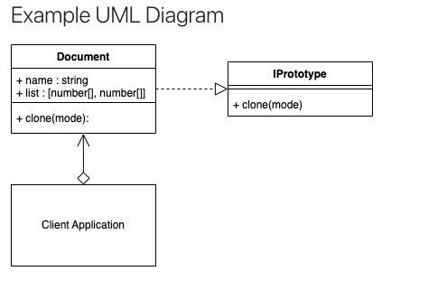

### Overview

TypeScript is a tool to help you write type-safe JavaScript. JavaScript is a weakly typed language which means that types are assigned implicitly as they are used at runtime. While this can be considered a feature, it can be dangerous if your code needs to be treating types precisely at all times. Enforcing type safety ensures that all usage of the properties, functions and classes are consistent within your application and as a result makes your application more robust.

### Compile The TypeScript File Into JavaScript}

Open the VSCode integrated terminal using the keys `Ctrl+Shift+`, or using the top menu `Terminal --> New Terminal`.
In the project root folder type.

`tsc ./src/test.ts --outDir ./dist`

### Adding tsconfig.json

Normally, it is best practice to create a tsconfig.json file in the base of your TypeScript source folder in your project.

```json
{
  "compilerOptions": {
    "strict": true,
    "target": "ES2020",
    "module": "CommonJS",
    "outDir": "../dist",
    "rootDir": "./",
    "moduleResolution": "node"
  },
  "include": ["**/*.ts"]
}
```

Now you can compile your test.ts into javascript by calling tsc and indicating the `tsconfig` location which is the `./src` folder.

- `"strict":true` : The strict flag enables a wide range of type checking behavior that results in stronger guarantees of program correctness. I mainly use it to ensure that all class properties are either assigned when first declared, or in the constructor.

- `"target": "ES2015"` : ES stands for ECMAScript which is a documented JavaScript standard. TSC will produce JavaScript that matches the selected standard. Options are ES3, ES5, ES2015, ES2016, ES2017, ES2018, ES2019, ES2020 and ESNEXT. Each ES version introduces new core JavaScript functionality. I have chosen ES2015 since TSC won't compile earlier versions if the source TypeScript contains private identifiers. Visit https://en.wikipedia.org/wiki/ECMAScript for more information about the ES version differences.

- `"module": "CommonJS"` : In many of the code examples in the course, I am using ES6 import/export syntax. The `CommonJS` module setting will produce output that relies on the popular `RequireJS` module loader that Node.js supports by default. This means that any JavaScript produced from TSC will work in Node.js in case your source TypeScript code contains any ES6 import commands.

- `"outDir": "../dist"` : This is the folder where the compiled JavaScript will be placed. Note that it has 2 dots indicating to go back/down one folder, and then up into the dist folder. This is relative to the rootDir parameter discussed in the next line.

- `"rootDir": "./" `: This is the root directory of the TypeScript project containing all of the \*.ts files, and not the project root directory which was referred to earlier that contains all of the projects files including the `src`, `dist`, `node_modules`, `package.json`, etc. It is the folder that TSC should consider to be the root when compiling.

- `"moduleResolution": "node"` : Is the default, and describes the file finding resolution process in which TSC will find dependencies if and when they are referenced in any code.

- `"include": ["**/*.ts"]` : Indicates to compile all files it finds ending in .ts in this and any sub folders relative to the rootDir setting within this same tsconfig.json.

#### Compile files

`tsc -p ./src`

For documentation on all the options that you can have in a tsconfig.json file, visit https://www.typescriptlang.org/tsconfig

#### TSC Watch

`tsc -p ./src -w`

### Common Types

#### Types

In the TypeScript version I have demonstrated explicitly setting some types of

- string
- boolean
- number
- array of numbers
- tuple
- dictionary
- set

```ts
let foo: string; //string
let bar: boolean; //boolean
let baz: number; //number
let qux: string[]; //array of string
let quuz: [number, string]; //a tuple of two elements consisting of a number and a string
let corge: { [key: number]: string }; //dictionary if string where the key is a number
let grault: Set<number>; //a Set of numbers

foo = "ABC";
bar = true;
baz = 123;
qux = ["a", "b", "c"];
quuz = [1, "abc"];
corge = { 123: "abc", 456: "def" };
grault = new Set([1, 2, 3]);
```

#### String

Some more string experiments you can try are:

```ts
let foo: string;
foo = "ABC";
foo = "123";
foo = "It wasn't me";
foo = "it wasn't me";
foo = `abc ${str} def`; //abc it wasn't me def
```

#### Boolean

A boolean can either be `true` or `false`.

```ts
let bar: boolean;
bar = true;
bar = false;
```

#### Number

A number can be written in many bases or with floating point precision.

```ts
let num: number;
num = 123; //decimal
num = 123.456; //float
num = 0xffff; //hex
num = 0b10101; //binary - "0b"+num.toString(2)
num = 0o671; //octal - "0o"+num.toString(8)
```

#### Array

An array is a JavaScript object first that can contain a series of any types,
but in TypeScript you can set the types explicitly or even as unknown.

```ts
let a: string[];
a = ["a", "b", "c", "d"];
let b: number[];
b = [1, 2, 3, 4, 5];
let c: boolean[];
c = [true, false, false];
let d: unknown[] = [1, "a", true, ["even", "another", "inner", "array"]];

console.log(d.length); //4
```

#### Dictionary

A Dictionary is used as a key/value construct, where you can retrieve a value from the dictionary by using a key.

Since Dictionaries are really just objects. You can also retrieve a dictionary's value using object
notation if the keys are strings

```ts
let a: { [key: number]: string };
a = { 123: "abc", 456: "def" };
let b: { [key: string]: boolean };
b = { abc: true, def: false, ghi: true };
let c: { [id: number]: number[] };
c = { 1: [1, 2, 3], 2: [4, 5, 6], 3: [7, 8, 9], 4: [10, 11, 12] };

console.log(a[123]); // abc
console.log(b["def"]); // false
console.log(c[1]); // [ 1, 2, 3 ]

console.log(a.123); // this doesn't work when the key is a number

delete a[456];
console.log(a); // { '123': 'abc' }
```

#### Tuple

The Tuple is similar to an array, but you are explicitly indicating how many items are
in the Tuple and of which type they are when you instantiate it. The Tuple type is not
directly supported in JavaScript as a Tuple, but as an array instead. The rules of the
Tuple are enforced in TypeScript only when it is created. After the Tuple is created,
it behaves the same as an array. You can add/remove/edit items.

```ts
let a: [number, string];
a = [1, "abc"];
let b: [string, boolean, number];
b = ["abc", false, 123];

a = [1] // Type '[number]' is not assignable to type '[number, string]'.
a = [1, "abc", true]; // Type '[number, string, boolean]' is not assignable to type '[number, string]'.

console.log(a[1]); // abc
console.log(b[2]); // 123
```

#### Set
The Set object lets you store unique values of any type. Any duplicate items added to the Set won't be added.

```ts
let sa: Set<number>;
sa = new Set([1, 2, 3, 4, 2]);
let sb: Set<string>;
sb = new Set(["a", "b", "c", "d", "a"]); // the second `a` is not added
let sc: Set<unknown>;
sc = new Set([1, "b", true]);

console.log(sa); // Set(4) { 1, 2, 3, 4 }
console.log(sb); // Set(4) { 'a', 'b', 'c', 'd' }
console.log(sc); // Set(3) { 1, 'b', true }

const d: Set<string> = new Set();
d.add("cat");
d.add("dog");
d.add("bird");
console.log(d); // Set(3) { 'cat', 'dog', 'bird' }

d.delete("cat");
console.log(sd); // Set(2) { 'dog', 'bird' }

console.log(d.size); // 2
console.log(d.has('dog')); // true
```

### Classes
Simply, they are a template that can be used when creating custom objects.

```ts
class Dog {
  name: string;

  constructor(name: string) {
    this.name = name;
  }

  walk(steps: number): void {
    console.log(this.name + ' the dog has walked ' + steps + ' steps');
  }
}

const dog = new Dog('pilin');
dog.walk(5); // pilin the dog has walked 5 steps
```

### Interfaces
Interfaces in TypeScript are a useful tool that you can use for your classes to ensure that they
conform to any specific rules that you want them to. This is especially useful if there are many
people working on the same code base, and any classes need to follow any specific rules.

```ts

interface IAnimal {
  name: string;
  age: number;
  feed(food: string, amount: number): void;
}

class Lion implements IAnimal {
  name: string;
  age: number;

  constructor(name: string, age: number) {
    this.name = name;
    this.age = age;
  }

  feed(food: string, amount: number): void {
    console.log(
      "Feeding " + this.name + " the lion " + amount + " kg of " + food
    );
  }
}

const lion = new Lion("Pumba", 4);
lion.feed("meat", 4); // Feeding Pumba the lion 4 kg of fish
```

### Extending clases
You can extend any existing class templates by using the `extends` keyword. The new class definition will be made up of the original class, but can optionally include its own new bespoke constructor, properties and/or methods. The new class definition is known as the derived class or subclass.
Extending a class is a different concept than implementing an interface.
With the derived class, the original class being extended is called the **base** or **super** class. It is a class that may have methods and properties that are common, but another class can be created from it that extends from this base/super class and has the option to override the constructor, methods and properties.The derived class also has the option to create additional methods and properties specific for its own needs. If the base class is using an interface, then any derived class will already comply provided that the base class was already correctly complying with its chosen interface.

```ts
class Car {
  reference: string;
  model: number;
  color: string;

  constructor(reference: string, model: number, color: string) {
    this.reference = reference;
    this.model = model;
    this.color = color;
  }

  accelerate(transmissionType: string, currentSpeed: number): void {
    console.log(
      'Accelerate', this.reference,
      'the', this.constructor.name,
      'transmission', transmissionType,
      'has current speed of', currentSpeed, 'kms/h'
    )
  }
}

class Mitsubishi extends Car {
  hasFuel: boolean;

  constructor(reference: string, model: number, color: string, hasFuel: boolean) {
    super(reference, model, color); // pointing base class
    this.hasFuel = hasFuel;
  }

  accelerate(transmissionType: string, currentSpeed: number): void { //override method
    if (this.hasFuel) {
      super.accelerate(transmissionType, currentSpeed);
    } else {
      console.log(this.reference, 'the', this.constructor.name, 'doesnt have fuel')
    }
  }
}

class Chevrolet extends Car {};

const chevrolet = new Chevrolet('Onix', 2018, 'grey');
chevrolet.accelerate('Manual', 110);
const mitsubishi = new Mitsubishi('Montero', 2018, 'grey', false);
mitsubishi.accelerate('Automatic', 180);
```

***Extending Class Example 2***
```ts
class Animal {
  name: string;
  age: number;

  constructor(name: string, age: number) {
    this.name = name;
    this.age = age;
  }

  feed(food: string, amount: number): void {
    console.log(
      "Feeding " +
        this.name +
        " the " +
        this.constructor.name +
        " " +
        amount +
        " kg of " +
        food
    );
  }
}

class Pig extends Animal {
  isHungry: boolean;
  name = 'Emy' //override property
  constructor(name: string, age: number, isHungry: boolean) {
    super(name, age);
    // this.name = name;
    this.isHungry = isHungry;
  }

  feed(food: string, amount: number): void {
    if (this.isHungry) {
      super.feed(food, amount);
    } else {
      console.log(
        "Feeding " +
          this.name +
          " the " +
          this.constructor.name +
          " is not hangry"
      );
    }
  }
}

class Horse extends Animal {}

const pig = new Pig("Niño", 2, false);   // Feeding Niño the Pig is not hangry
const horse = new Horse("Galopante", 1);

pig.feed("Afrecho", 4);
horse.feed("grass", 8); // Feeding Galopante the Horse 8 kg of grass
```

### Abstract class
You can extend classes with Abstract classes. Consider an abstract class as a base class. It is a
class that may have methods and properties that are common, but another class can be created
which extends from this base class and overrides any existing methods or can add additional methods
and properties specific for itself.

It is different than an `interface` in the way that is not indicating rules that the class must follow,
but the class that is extending will already have its own copies of the base classes properties and
methods once any new object is instantiated using it.
Abstract classes are like a mixture of implementing interfaces and extending a class in one step. You can create a class with optional methods and properties, but also indicate which methods and properties must be implemented in the derived class. Note that your base class, despite enforcing abstract rules, is still able to itself implement any interfaces you desire.

Use the `abstract` keyword to indicate a class contains `abstract` methods or properties.
If any methods are marked as abstract, then they must also be implemented in the derived class.

```ts
abstract class Animal {
  abstract name: string;
  age: number;

  constructor(age: number) {
    // this.name = name; // Abstract property 'name' in class 'Animal' cannot be accessed in the constructor.
    this.age = age;
  }

  abstract feed(food: string, amount: number): void;
}

class Pig extends Animal {
  isHungry: boolean;
  name: string;
  constructor(name: string, age: number, isHungry: boolean) {
    super(age);
    this.name = name;
    this.isHungry = isHungry;
  }

  feed(food: string, amount: number): void {
    if (this.isHungry) {
      console.log(
        "Feeding " +
          this.name +
          " the " +
          this.constructor.name +
          " " +
          amount +
          " kg of " +
          food
      );
    } else {
      console.log(
        "Feeding " +
          this.name +
          " the " +
          this.constructor.name +
          " is not hangry"
      );
    }
  }
}

class Horse extends Animal {
  name: string;
  constructor(name: string, age:number) {
    super(age);
    this.name = name;
  }

  feed(food: string, amount: number): void {
    console.log(
      "Feeding " +
        this.name +
        " the " +
        this.constructor.name +
        " " +
        amount +
        " kg of " +
        food
    );
  }
}

const pig = new Pig("Niño", 2, false);
const horse = new Horse("Galopante", 1);

pig.feed("Afrecho", 4);
horse.feed("grass", 8);
```

### Access Modifiers
TypeScript supports access modifiers for your class properties and methods.

#### Public
In JavaScript, all class properties are public by default so there is no need to write
the public keyword in your TypeScript files.

```ts
class Device {
  public name: string;

  constructor(name:string) {
    this.name = name;
  }

}

const device = new Device('Tv');
console.log(device.name)
```

#### Private
TypeScript also has its own way to declare a member as being marked private, it cannot be accessed
from outside of its containing class.

```ts
class Device {
  private name: string;

  constructor(name:string) {
    this.name = name;
  }
}

class TV extends Device {
  constructor(name: string) {
    super(name)
    console.log(this.name); // Property 'name' is private and only accessible within class 'Device'.
  }
}

const device = new Device('Tv');
console.log(device.name) //Property 'name' is private and only accessible within class 'Device'
```

#### Protected
The protected modifier acts much like the private modifier with the exception that members declared
protected can also be accessed within subclasses.

```ts
class Device {
  protected name: string;

  constructor(name:string) {
    this.name = name;
  }

}

class TV extends Device {
  constructor(name: string) {
    super(name)
  }
}

const device = new Device('Tv');
console.log(device.name) // Property 'name' is protected and only accessible within class 'Device' and its subclasses
```

### Static Members
Now it's possible to make objects that were instantiated from classes share the same methods and properties behind the scenes, and that is using the `static` keyword.

The code below shows some examples of the `static` keyword and how the `static` properties and methods are referred to.

```ts
class ClassWithProperty {
    abc = 123
}

class ClassWithStaticProperty {
    static abc = 123
}

class ClassWithMethod {
    method() {
        return 123
    }
}

class ClassWithStaticMethod {
    static method() {
        return 123
    }
}

const classWithProperty = new ClassWithProperty();
console.log(classWithProperty.abc); // 123

// const classWithStaticProperty = new ClassWithStaticProperty();
// console.log(classWithStaticProperty.abc); // Property 'abc' does not exist on type 'ClassWithStaticProperty'.
console.log(ClassWithStaticProperty.abc); // 123

const classWithMethod = new ClassWithMethod();
console.log(classWithMethod.method());

// const classWithStaticMethod = new ClassWithStaticMethod();
// console.log(classWithStaticMethod.method()); // Property 'method' does not exist on type 'ClassWithStaticMethod'
console.log(ClassWithStaticMethod.method());
```

One particular example where a static property may be useful is in the example below where the property `PI` doesn't need to be recreated across each new instance of the Circle class, but all instances of the `circle` can point to the same value stored at the class level instead.

```ts
class Circle {
  radius: number;
  static PI = 3.14;

  constructor(radius: number) {
    this.radius = radius
  }
}

console.log('Circle.PI = ' + Circle.PI);
const CIRCLE1 = new Circle(1);
const CIRCLE2 = new Circle(2);
console.log('CIRCLE1 Area = ' + Circle.PI * CIRCLE1.radius ** 2);
console.log('CIRCLE2 Area = ' + Circle.PI * CIRCLE2.radius ** 2);
```

### ES6 Modules
On larger projects, it is common to split up your code into separate files. When doing this, you will need to tell each file which other file it needs to reference in case it is using objects, classes, types or interfaces from the other files.

`./src/test.ts`
```ts
import { Cat, Dog } from './animals'

const CAT = new Cat('Cosmo', 8)
console.log(CAT.name)
const DOG = new Dog('Rusty', 12)
console.log(DOG.name)
```
`./src/animals.ts`
```ts
import Animal from './animal'

export class Cat extends Animal {
    constructor(name: string, age: number) {
        super(name, age)
    }
}

export class Dog extends Animal {}
```
`./src/animal.ts`
```ts
export default class Animal {
    name: string
    age: number

    constructor(name: string, age: number) {
        this.name = name
        this.age = age
    }
}
```

### UML Diagram
Unified Modeling Language (UML) Diagrams are used throughout the course to help describe the patterns. [UML Diagram](https://sbcode.net/typescript/uml_diagrams/)

* `Directed Association`: A filled arrow with a line.

***ClassA*** uses ***ClassB*** or an object of ***ClassB***.

ClassA calls a static class method, a static abstract method or a method/property/field from an object of type ClassB. e.g., The ***Person*** starts the ***Car*** engine.

* `A Class That Extends/Inherits A Class`: An unfilled arrow, with a line pointing to the class that is being extended/inherited.

***ClassA*** extends ***ClassB***.

The extended class contains all the attributes/fields and methods of the inherited class, including its own extra methods, attributes/fields, overrides and overloads.

* `A Class That Implements an Interface`* : An unfilled arrow, with a dashed line pointing to the interface that is being implemented.

***ClassA*** implements ***ClassB***.

A class that implements an interface must implement all the methods declared in the interface.

* `Aggregates`: An unfilled diamond with a line and arrow head.

***ClassA*** aggregates ***ClassB***.

`Library` aggregates `Books`. Books and Library can exist independently of each other. Books can exist without the Library.

* `Composition`: A filled diamond with a line and arrow head.

***ClassA*** is composed of ***ClassB***

***Aeroplane*** can be composed of ***Wings*** and other parts. But an aero plane is no longer really an aero plane without its wings.

* `Pseudocode Annotation`: A box with a dashed line and a circle placed near a class method.

Pseudocode is a plain language description of the steps in an algorithm and used to portray a concept without needing to write long lines of code.

## Creational
### Factory Design Pattern
When developing code, you may instantiate objects directly in methods or in classes. While this is quite normal, you may want to add an extra abstraction between the creation of the object and where it is used in your project.

You can use the Factory pattern to add that extra abstraction. The Factory pattern is one of the easiest patterns to understand and implement.

Adding an extra abstraction will also allow you to dynamically choose classes to instantiate based on some kind of logic.

This separation also makes your code easier to read and document.

The Factory pattern is really about adding that extra abstraction between the object creation and where it is used. This gives you extra options that you can more easily extend in the future.

#### Terminology

***Concrete Creator***: The client application, class or method that calls the Creator (Factory method).

***Product Interface***: The interface describing the attributes and methods that the Factory will require in order to create the final product/object.

***Creator***: The Factory class. Declares the Factory method that will return the object requested from it.

***Concrete Product***: The object returned from the Factory. The object implements the Product interface.


#### Source Code

```ts
// dimension.ts
export type dimension = {
  height: number;
  width: number;
  depth: number;
}

// chair.ts
import { dimension } from "./dimension";

// A Chair Interface
export interface IChair {
  height: number;
  width: number;
  depth: number;
  getDimension: () => dimension;
}

// Chair Base Class
export default class Chair implements IChair {
  height = 0;
  width = 0;
  depth = 0;

  getDimension(): dimension {
    return {
      height: this.height,
      width: this.width,
      depth: this.depth
    }
  }
}

// smallChair.ts
import Chair from "./chair";

export default class SmallChair extends Chair {
  constructor() {
    super();
    this.height = 40;
    this.width = 40;
    this.depth = 40;
  }
}

// mediumChair.ts
import Chair from "./chair";

export default class MediumChair extends Chair {
  constructor() {
    super();
    this.height = 60;
    this.width = 60;
    this.depth = 60;
  }
}

// bigChair.ts
import Chair from "./chair";

export default class BigChair extends Chair {
  constructor() {
    super();
    this.height = 80;
    this.width = 80;
    this.depth = 80;
  }
}

// chairFactory.ts
import BigChair from "./bigChair";
import { IChair } from "./chair";
import MediumChair from "./mediumChair";
import SmallChair from "./smallChair";

export default class ChairFactory {
  static getChair(chair: string): IChair {
    if (chair === 'BigChair') {
      return new BigChair();
    } else if (chair === 'MediumChair') {
      return new MediumChair();
    } else {
      return new SmallChair();
    }
  }
}

// Factory use case - example code
import ChairFactory from './chairFactory';

const CHAIR = ChairFactory.getChair('SmallChair');
console.log(CHAIR.getDimension());
```

#### Summary

* The Factory Pattern defers the creation of the final object to a subclass.
* The Factory pattern is about inserting another layer/abstraction between instantiating an object and where in your code it is actually used.
* It is unknown what or how many objects you will need to be created until runtime.
* You want to localize knowledge of the specifics of instantiating a particular object to the subclass so that the client doesn't need to be concerned about the details.
* You want to create an external framework, that an application can import/reference, and hide the details of the specifics involved in creating the final object/product.
* The unique factor that defines the Factory pattern, is that your project now defers the creation of objects to the subclass that the factory had delegated it to.

### Abstract Factory Design Pattern

The Abstract Factory Pattern adds an abstraction layer over multiple other creational pattern implementations.

To begin with, in simple terms, think if it as a Factory that can return Factories. Although you will find examples of it also being used to return Builder, Prototypes, Singletons or other design pattern implementations.

#### Terminology

***Client***: The client application that calls the Abstract Factory. It's the same process as the *Concrete Creator* in the Factory design pattern.

***Abstract Factory***: A common interface over all the sub factories.

***Concrete Factory***: The sub factory of the Abstract Factory and contains method(s) to allow creating the Concrete Product.

***Abstract Product***: The interface and/or abstraction for the product that the sub factory returns.

***Concrete Product***: The object that is finally returned.

#### Abstract Factory Example Use Case
An example use case may be that you have a furniture shopfront. You sell many kinds of furniture. You sell chairs and tables. And they are manufactured at different factories using different unrelated processes that are not important for your concern. You only need the factory to deliver.

You can create an extra module called FurnitureFactory, to handle the chair and table factories, thus removing the implementation details from the client.


#### Source Code

```ts
// dimension.ts
export type dimension = {
  height: number;
  width: number;
  depth: number;
}

// chair.ts
import { dimension } from "./dimension";

export interface IChair {
  name: string;
  height: number;
  width: number;
  depth: number;

  getDimension(): dimension;
}

export class Chair implements IChair {
  name = '';
  height = 0;
  width = 0;
  depth = 0;

  getDimension(): dimension {
    return {
      width: this.width,
      height: this.height,
      depth: this.depth
    }
  }
}

// smallChair.ts
import { Chair } from "./chair";

export class SmallChair extends Chair {
  constructor() {
    super();
    this.name = 'Small Chair';
    this.height = 40;
    this.width = 40;
    this.depth = 40;
  }
}

// mediumChair.ts
import { Chair } from "./chair";

export class MediumChair extends Chair {
  constructor() {
    super();
    this.name = 'Medium Chair';
    this.height = 60;
    this.width = 60;
    this.depth = 60;
  }
}

// bigChair.ts
import { Chair } from "./chair";

export class BigChair extends Chair {
  constructor() {
    super();
    this.name = 'Big Chair';
    this.height = 80;
    this.width = 80;
    this.depth = 80;
  }
}

// chairFactory.ts
import { BigChair } from "./bigChair";
import { Chair, IChair } from "./chair";
import { MediumChair } from "./mediumChair";
import { SmallChair } from "./smallChair";

enum ChairsType {
  SmallChair = 'SmallChair',
  MediumChair = 'MediumChair',
  BigChair = 'BigChair'
}

export class ChairFactory {
  static getChair(chairType: string): IChair {
    try {
      if(chairType === ChairsType.SmallChair) {
        return new SmallChair();
      } else if(chairType === ChairsType.MediumChair) {
        return new MediumChair();
      } else if (chairType === ChairsType.BigChair) {
        return new BigChair();
      } else {
        throw new Error('Class not found');
      }
    } catch(e) {
      console.log(e)
    }
    return new Chair();
  }
}

// table.ts
import { dimension } from "./dimension";

export interface ITable {
  name: string;
  height: number;
  width: number;
  depth: number;

  getDimension(): dimension;
}

export class Table implements ITable {
  name = '';
  height = 0;
  width = 0;
  depth = 0;

  getDimension(): dimension {
    return {
      width: this.width,
      height: this.height,
      depth: this.depth
    }
  }
}

// smallTable.ts
import { Table } from "./table";

export class SmallTable extends Table {
  constructor() {
    super();
    this.name = 'Small Table';
    this.height = 50;
    this.width = 50;
    this.depth = 50;
  }
}

// mediumTable.ts
import { Table } from "./table";

export class MediumTable extends Table {
  constructor() {
    super();
    this.name = 'Medium Table';
    this.height = 80;
    this.width = 80;
    this.depth = 80;
  }
}

// bigTable.ts
import { Table } from "./table";

export class BigTable extends Table {
  constructor() {
    super();
    this.name = 'Big Table';
    this.height = 100;
    this.width = 100;
    this.depth = 100;
  }
}

// tableFactory.ts
import { BigTable } from "./bigTable";
import { MediumTable } from "./mediumTable";
import { SmallTable } from "./smallTable";
import { ITable, Table } from "./table";

enum TablesType {
  SmallTable = 'SmallTable',
  MediumTable = 'MediumTable',
  BigTable = 'BigTable'
}

export class TableFactory {
  static getTable(tableType: string): ITable {
    try {
      if (tableType === TablesType.SmallTable) {
        return new SmallTable();
      } else if (tableType === TablesType.MediumTable) {
        return new MediumTable();
      } else if(tableType === TablesType.BigTable) {
        return new BigTable();
      } else {
        throw new Error('Class not found');
      }
    } catch(e) {
      console.log(e);
    }
    return new Table();
  }
}

// fornitureFactory.ts
import { IChair } from "./chair";
import { ChairFactory } from "./chairFactory";
import { ITable } from "./table";
import { TableFactory } from "./TableFactory";

export interface IForniture extends IChair, ITable {};

const chairs = ['SmallChair', 'MediumChair', 'BigChair'];
const tables = ['SmallTable', 'MediumTable', 'BigTable'];

export class FornitureFactory {
  static getFurniture(forniture: string): IForniture | undefined {
    try {
      if (chairs.indexOf(forniture) > -1) {
        return ChairFactory.getChair(forniture);
      }
      if (tables.indexOf(forniture) > -1) {
        return TableFactory.getTable(forniture);
      }
      throw new Error('Factory not Found');
    } catch(e) {
      console.log(e)
    }
  }
}

// client.ts
import { FornitureFactory } from "./furnitureFactory";

let FORNITURE = FornitureFactory.getFurniture('SmallChair');
console.log(FORNITURE?.name);
console.log(FORNITURE?.getDimension());

FORNITURE = FornitureFactory.getFurniture('BigTable');
console.log(FORNITURE?.name);
console.log(FORNITURE?.getDimension());
```

### Builder Design Pattern
The Builder Pattern is a creational pattern whose intent is to separate the construction of a complex object from its representation so that you can use the same construction process to create different representations.

The Builder Pattern tries to solve,

* How can a class create different representations of a complex object?
* How can a class that includes creating a complex object be simplified?

The Builder and Factory patterns are very similar in the fact they both instantiate new objects at runtime. The difference is when the process of creating the object is more complex, so rather than the Factory returning a new instance of `ObjectA`, it calls the builders' director constructor method `ObjectA.construct()` that goes through a more complex construction process involving several steps. Both return an Object/Product.

#### Terminology
***Product***: The Product being built.
***Builder Interface***: The Interface that the Concrete builder should implement.
***Builder***: Provides methods to build and retrieve the concrete product. Implements the Builder Interface.
***Director***: Has a construct() method that when called creates a customized product using the methods of the Builder.

#### Builder Use Case
Using the Builder Pattern in the context of a House Builder.
There are multiple directors that can create their own complex objects.
Note that in the `IglooDirector` class, not all the methods of the HouseBuilder were called.
The builder can construct complex objects in any order and include/exclude whichever parts it likes.


```ts
// house.ts
export default class House {
  doors: number = 0;
  windows: number = 0;
  wallMaterial: string = '';
  buildingType: string = '';

  construction(){
    return `This is a ${this.wallMaterial} ${this.buildingType} with ${this.doors} door(s) and ${this.windows} window(s).`;
  }
}

// houseBuilder.ts
import House from "./house";

interface IHouseBuilder {
  house: House;
  setBuildingType(buildingType: string): this;
  setWallMaterial(wallMaterial: string): this;
  setNumberDoors(doors: number): this;
  setNumberWindows(windows: number): this;
  getResult(): House
}

export default class HouseBuilder implements IHouseBuilder {
  house: House;

  constructor() {
    this.house = new House();
  }

  setBuildingType(buildingType: string): this {
    this.house.buildingType = buildingType;
    return this;
  }

  setNumberDoors(doors: number): this {
    this.house.doors = doors;
    return this;
  }

  setWallMaterial(wallMaterial: string): this {
    this.house.wallMaterial = wallMaterial;
    return this;
  }

  setNumberWindows(windows: number): this {
    this.house.windows = windows;
    return this;
  }

  getResult(): House {
    return this.house
  }
}

// directorBoat.ts
import House from "./house";
import HouseBuilder from "./houseBuilder";

export default class DirectorBoat {
  static contruct(): House {
    return new HouseBuilder()
      .setBuildingType('House Boat')
      .setWallMaterial('Wood')
      .setNumberDoors(6)
      .setNumberWindows(4)
      .getResult();
  }
}

// directorCastle.ts
import House from "./house";
import HouseBuilder from "./houseBuilder";

export default class DirectorCastle {
  static contruct(): House {
    return new HouseBuilder()
      .setBuildingType('Castle')
      .setWallMaterial('Sandstone')
      .setNumberDoors(10)
      .setNumberWindows(14)
      .getResult();
  }
}

// directorIgloo.ts
import House from "./house";
import HouseBuilder from "./houseBuilder";

export default class DirectorIgloo {
  static construct(): House {
    return new HouseBuilder()
      .setBuildingType('Igloo')
      .setWallMaterial('Ice')
      .setNumberDoors(1)
      .getResult()
  }
}

// client.ts
import DirectorBoat from "./directorBoat";
import DirectorCastle from "./directorCastle";
import DirectorIgloo from "./directorIgloo";

const IGLOO = DirectorIgloo.construct();
const CASTLE = DirectorCastle.contruct();
const BOAT = DirectorBoat.contruct();

console.log(IGLOO.construction()); // This is a Ice Igloo with 1 door(s) and 0 window(s).
console.log(CASTLE.construction()); // This is a Sandstone Castle with 10 door(s) and 14 window(s).
console.log(BOAT.construction()); // This is a Wood House Boat with 6 door(s) and 4 window(s).
```
#### Summary
The Builder pattern is a creational pattern that is used to create more complex objects than you'd expect from a factory.
The Builder pattern should be able to construct complex objects in any order and include/exclude whichever available components it likes.
For different combinations of products than can be returned from a Builder, use a specific Director to create the bespoke combination.
You can use an `Abstract Factory` to add an abstraction between the client and Director.

### Prototype Design Pattern
The Prototype design pattern is good for when creating new objects requires more resources than you want to use or have available. You can save resources by just creating a copy of any existing object that is already in memory.
In the Prototype patterns interface, you create a clone method that should be implemented by all classes that use the interface. How the clone method is implemented in the concrete class is up to you. You will need to decide whether a shallow or deep copy is required.

* A shallow copy, copies and creates new references one level deep,
* A deep copy, copies and creates new references for all levels.


#### Terminology
***Prototype Interface***: The interface that describes the clone() method.
***Prototype***: The Object/Product that implements the Prototype interface.
***Client***: The client application that uses and creates the ProtoType.

#### Prototype Use Case
In this example, an object called document is cloned using shallow and deep methods.

I clone the documents instance properties and methods.

The object contains an array of two arrays. Three copies are created, and each time some part of the array is changed on the clone, and depending on the method used, it can affect the original object.

When cloning an object, it is good to understand the deep versus shallow concept of copying and whether you also want the clone to contain the classes methods.



#### Prototype Use Case
In this example, an object called document is cloned using shallow and deep methods.
I clone the documents instance properties and methods.
The object contains an array of two arrays. Three copies are created, and each time some part of the array is changed on the clone, and depending on the method used, it can affect the original object.
When cloning an object, it is good to understand the deep versus shallow concept of copying and whether you also want the clone to contain the classes methods.

```ts
// iprototype.ts
// Prototype concept sample code
import Document from "./document";

export default interface IPrototype {
  clone(mode: number): Document;
}

// document.ts
import ProtoType from './iPrototype';

export default class Document implements ProtoType {
  name: string;
  array: [number[], number[]];

  constructor(name: string, array:[number[], number[]]) {
    this.name = name;
    this.array = array;
  }

  clone(mode: number): Document {
    // This clone method uses different copy techniques
    let array;
    if(mode === 2) {
      // results in a deep copy of the Document
      array = JSON.parse(JSON.stringify(this.array));
    } else {
      // default, results in a shallow copy of the Document
      array = Object.assign([], this.array);
    }
    return new Document(this.name, array);
  }
}

// client.ts
import Document from "./document";

// Creating a document containing an array of two arrays
const ORIGINAL_DOCUMENT = new Document('Original', [
  [1, 2, 3, 4],
  [5, 6, 7, 8]
]);
console.log(ORIGINAL_DOCUMENT);

const DOCUMENT_COPY_1 = ORIGINAL_DOCUMENT.clone(1); // shallow copy
DOCUMENT_COPY_1.name = 'Copy 1';
// This also modified ORIGINAL_DOCUMENT because of the shallow copy
// when using mode 1
DOCUMENT_COPY_1.array[1][1] = 200;
console.log(DOCUMENT_COPY_1);
console.log(ORIGINAL_DOCUMENT);

const DOCUMENT_COPY_2 = ORIGINAL_DOCUMENT.clone(1) // shallow copy
DOCUMENT_COPY_2.name = 'Copy 2'
// This does NOT modify ORIGINAL_DOCUMENT because it changes the
// complete array[1] reference that was shallow copied when using mode 1
DOCUMENT_COPY_2.array[1] = [9, 10, 11, 12];
console.log(DOCUMENT_COPY_2);
console.log(ORIGINAL_DOCUMENT);

const DOCUMENT_COPY_3 = ORIGINAL_DOCUMENT.clone(2); // deep copy
DOCUMENT_COPY_3.name = 'Copy 3';
// This does modify ORIGINAL_DOCUMENT because it changes the element of
// array[1][0] that was deep copied recursively when using mode 2
DOCUMENT_COPY_3.array[1][0] = 1234;
console.log(DOCUMENT_COPY_3);
console.log(ORIGINAL_DOCUMENT);
```

#### Summary
* Just like the other creational patterns, a Prototype is used to create an object at runtime.
* A Prototype is created from an object that is already instantiated. Imagine using the existing object as the class template to create a new object, rather than calling a specific class. Note that, the clone method used in the concept video demonstrated didn't copy the class methods to the new object. The clones only contained copies of the instance properties. If you want your new clone to have the same methods of the original class, then use the classes' constructor when returning the clone as I did in the `clone(mode)` method in `document.ts`.
* The ability to create a Prototype means that you don't need to create many classes for specific combinations of objects. You can create one object, that has a specific configuration, then clone it and alter some factor of it, then create another clone from this altered configuration, and keep continuing to create many objects which are all slightly different from each other.
* New Prototypes can be created at runtime, without knowing what kind of attributes the prototype may eventually have. E.g., You have a sophisticated object that was randomly created from many factors, and you want to clone it rather than adding all those same factors over and over again until the new object matches the one that could have just been cloned.
* A prototype is also useful for when you want to create a copy of an object, but creating that copy may be very resource intensive. E.g., you can either create a new houseboat from the builder example, or clone an existing houseboat from one already in memory.
When designing your clone() method, you should consider which elements will be shallow copied or deep copied.

### Singleton Design Pattern
Sometimes you need an object in an application where there is only one instance.
You don't want there to be many versions, for example, you have a game with a score, and you want to adjust it. You may have accidentally created several instances of the class holding the score object. Or, you may be opening a database connection, there is no need to create many, when you can use the existing one that is already in memory. You may want a logging component, and you want to ensure all classes use the same instance. So, every class could declare their own logger component, but behind the scenes, they all point to the same memory address.
By creating a class and following the *Singleton* pattern, you can enforce that even if any number of instances were created, they will still refer to the original class.
The Singleton can be accessible globally, but it is not a global variable. The Singleton class can be instanced at any time, but after it is first instanced, any new instances will point to the same instance as the first.


#### Singleton Use Case
In the example, there are three games created. They are all independent instances created from their own class, but they all share the same leaderboard. The leaderboard is a Singleton.

It doesn't matter how the Games where created, or how they reference the leaderboard, it is always a Singleton.

Each game independently adds a winner, and all games can read the altered leaderboard regardless of which game updated it.

```ts
// igame.ts
// A Game interface
export default interface IGame {
  addWinner(position: number, name: string): void
}

// leaderboard.ts
// A Leaderboard Singleton class
export default class Leaderboard {
  static instance: Leaderboard;
  #table: { [id: number]: string } = {}

  constructor() {
    if(Leaderboard.instance) {
      return Leaderboard.instance;
    }
    Leaderboard.instance = this;
  }

  public addWinner(position: number, name: string) {
    this.#table[position] = name;
  }

  public print() {
    console.log('-------Leaderboard-------');
    for (const key in this.#table) {
      console.log(`|\t${key}\t${this.#table[key]}\t|`);
    }
  }
}

// game1.ts
// A Game Class that uses the leaderboard Singleton
import Leaderboard from "./leaderboard";
import Game from './igame';

export default class Game1 implements Game {
  leaderBoard: Leaderboard;

  constructor() {
    this.leaderBoard = new Leaderboard();
  }

  addWinner(position: number, name: string): void {
    this.leaderBoard.addWinner(position, name);
  }
}

// game2.ts
// A Game Class that uses the leaderboard Singleton
import Leaderboard from "./leaderboard";
import Game from './igame';

export default class Game2 implements Game {
  leaderBoard: Leaderboard;

  constructor() {
    this.leaderBoard = new Leaderboard();
  }

  addWinner(position: number, name: string): void {
    this.leaderBoard.addWinner(position, name);
  }
}

// game3.ts
// A Game Class that uses the leaderboard Singleton
import Leaderboard from "./leaderboard";
import Game from './igame';

export default class Game3 implements Game {
  leaderBoard: Leaderboard;

  constructor() {
    this.leaderBoard = new Leaderboard()
  }

  addWinner(position: number, name: string): void {
      this.leaderBoard.addWinner(position, name);
  }
}

// cleint.ts
import Game1 from "./game1";
import Game2 from "./game2";
import Game3 from "./game3";

// The Client
// Despite all games instantiating a leaderboard, they all point
// to the same memory object since the leaderboard is a singleton.
const GAME1 = new Game1();
const GAME11 = new Game1();
GAME1.addWinner(3, 'Cosmo');
GAME11.addWinner(7, 'Susan');

const GAME2 = new Game2();
GAME2.addWinner(2, 'Sean');

const GAME3 = new Game3();
GAME3.addWinner(4, 'Emmy');

GAME1.leaderBoard.print();
GAME2.leaderBoard.print();
GAME3.leaderBoard.print();
/*
-------Leaderboard-------
|       2       Sean    |
|       3       Cosmo   |
|       4       Emmy    |
|       7       Susan   |
-------Leaderboard-------
|       2       Sean    |
|       3       Cosmo   |
|       4       Emmy    |
|       7       Susan   |
-------Leaderboard-------
|       2       Sean    |
|       3       Cosmo   |
|       4       Emmy    |
|       7       Susan   |
*/
```
